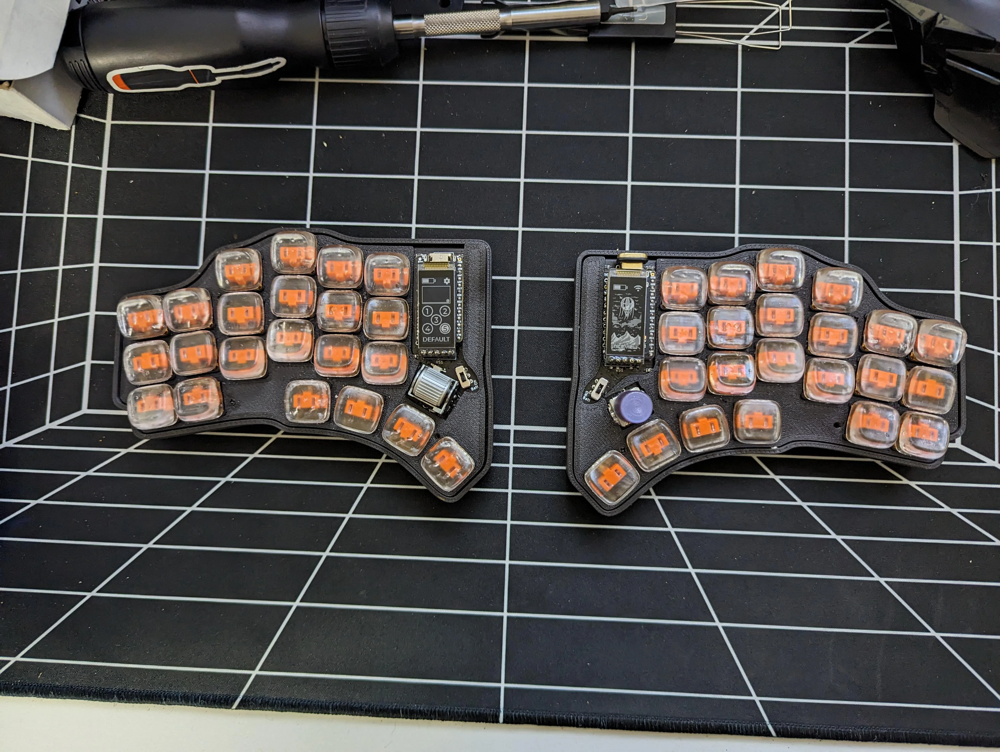
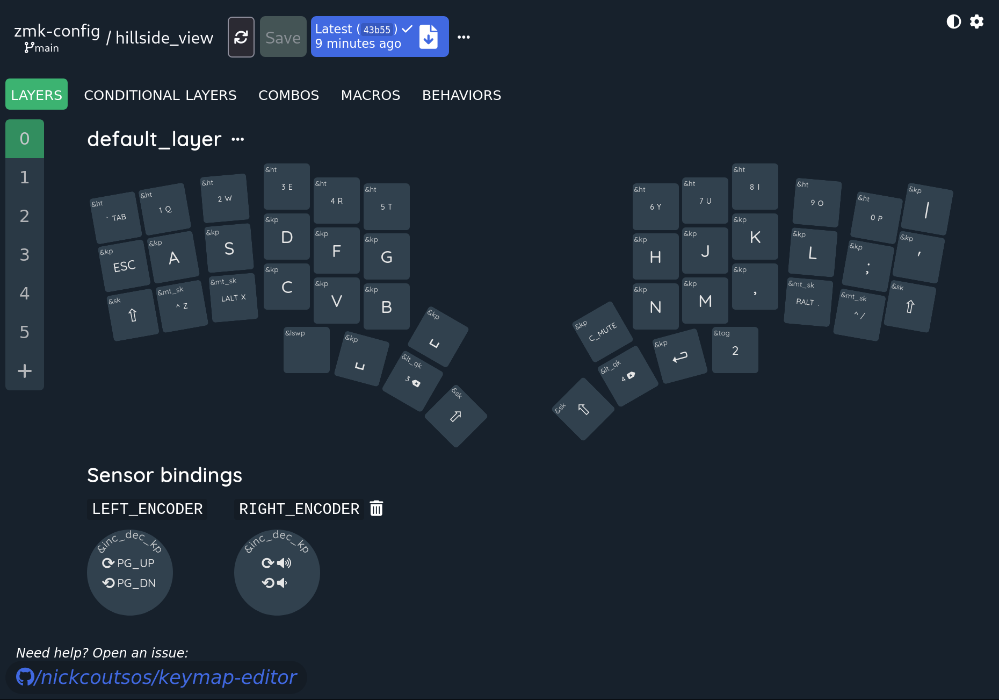
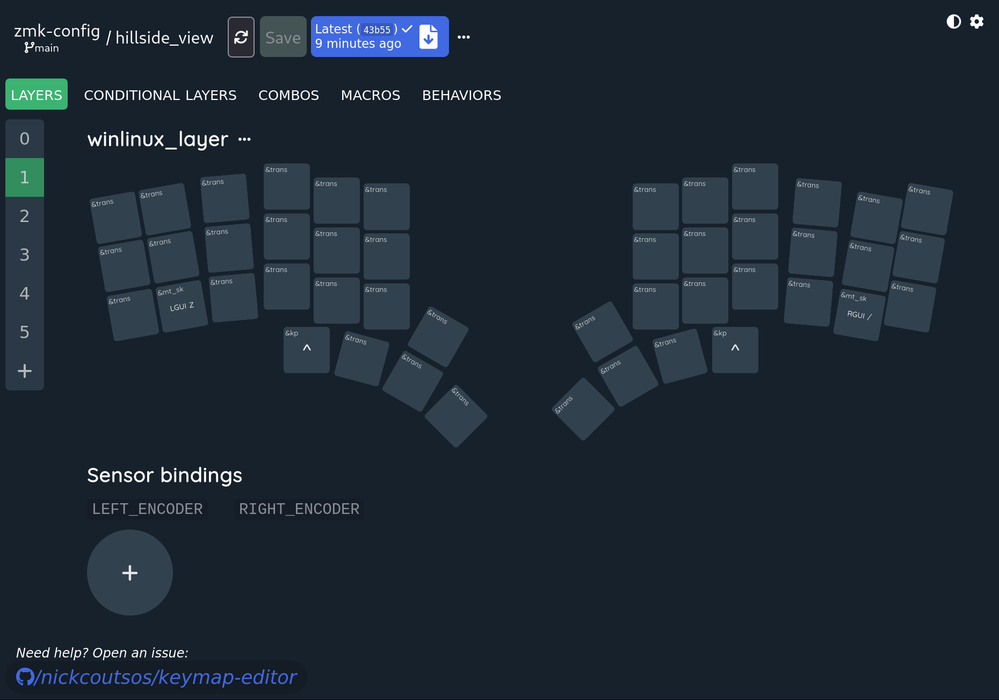
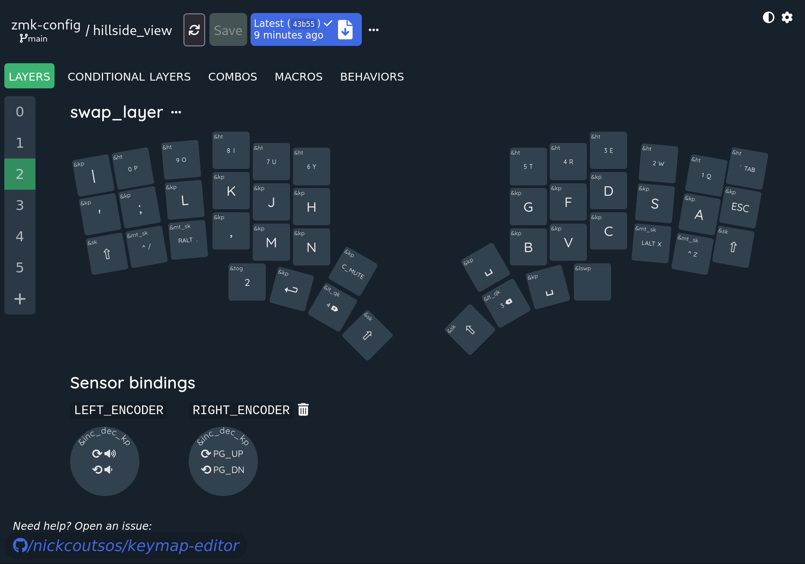
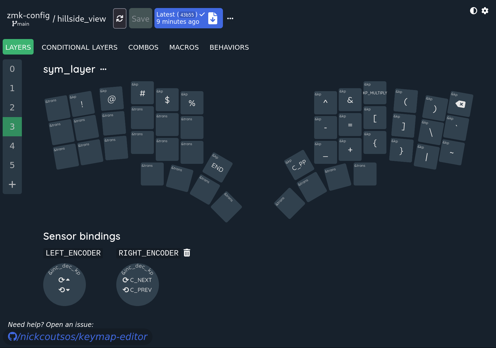
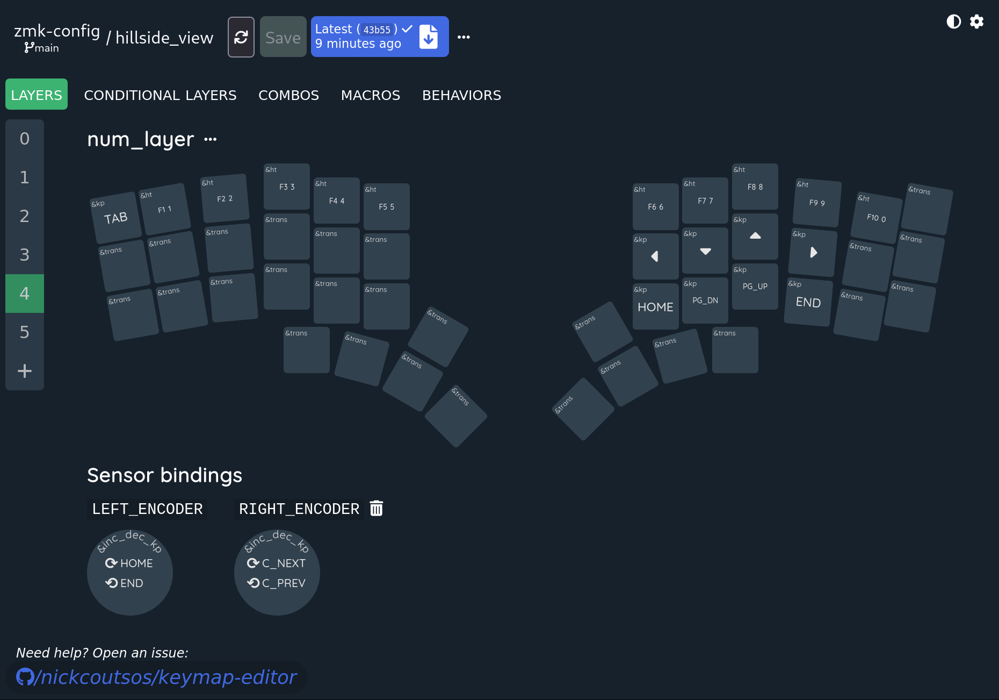
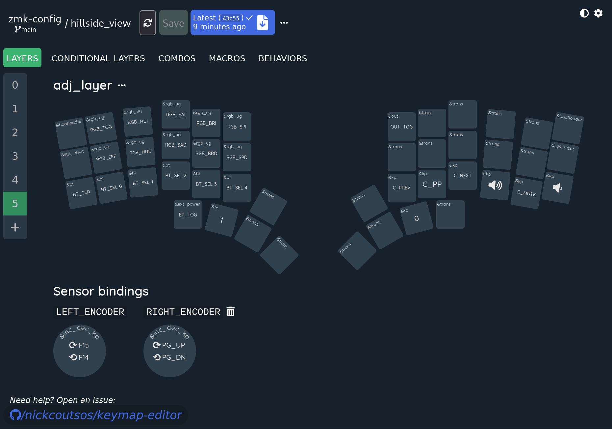
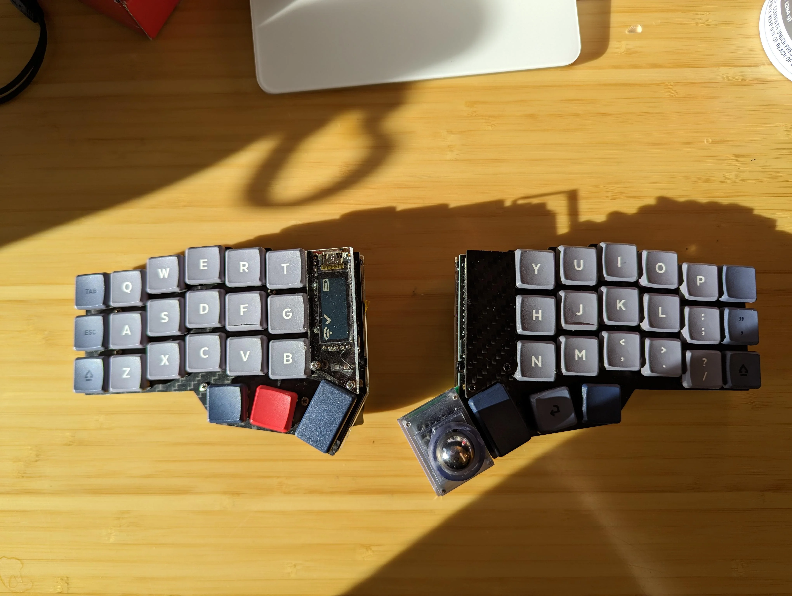

ZMK keymaps
===========

This repo contains configurations for my ZMK based keyboards

## Hillside View

[Hillside View](https://github.com/wannabecoffeenerd/HillSideView/) is a fork of [Hillside 46] with support for sharp display, bottom side MCU and future Cirque trackpad support.

### Layout

Made with https://nickcoutsos.github.io/keymap-editor/

## Corne

Config is located on the [corne branch](https://github.com/mike1808/zmk-config/tree/corne).
I have removed it from the main branch since I was not using it.

## Charybdis

Charybdis 4x6 with a trackball running pwm3360. 
